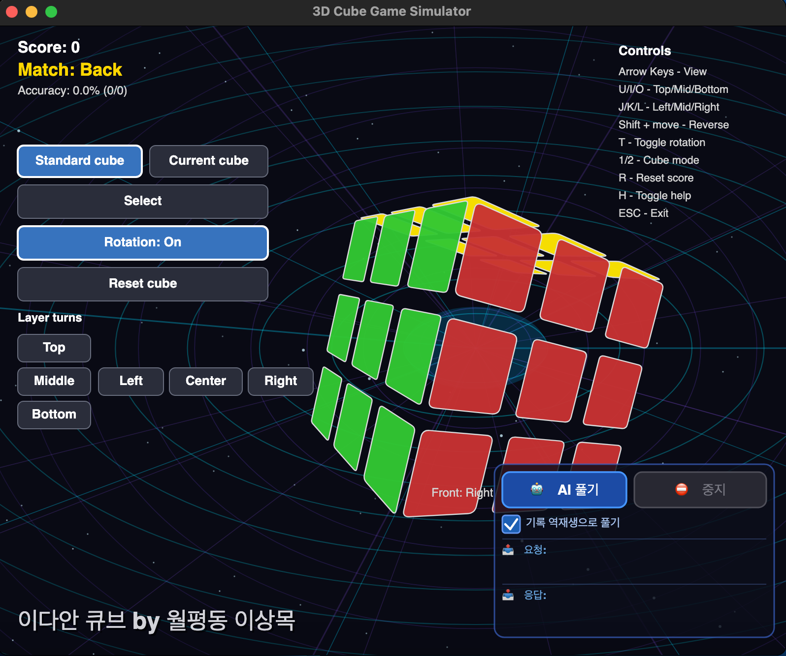

# CubeGame

A .NET 9 desktop Rubik's cube matching game built with Avalonia (cross-platform) and a legacy Windows Forms prototype.



## Gameplay

Rotate a 3×3 cube with arrow keys, turn layers with `U`/`I`/`O`/`J`/`K`/`L`, and press **Space** when the visible front face matches the target. Score points, build combos, and use the AI undo solver to revert your moves.

## Features

- 3D isometric cube rendered manually with `DrawingContext` (no OpenGL)
- Real-time layer turn animation with ease-in-out
- Match detection, combo scoring, accuracy tracking
- AI undo solver with optional OpenRouter-backed commentary
- Auto-rotation idle animation
- State persistence across sessions
- Mouse-clickable HUD buttons

## Quick Start

```bash
dotnet build CubeGame.sln
./run-avalonia.sh        # macOS
```

On Windows/Linux: `dotnet run --project CubeGame.Avalonia`

## Controls

| Key           | Action                     |
|---------------|----------------------------|
| Arrow keys    | Rotate camera view         |
| `U` `I` `O`   | Top / Middle / Bottom layer|
| `J` `K` `L`   | Left / Center / Right layer|
| `Shift`+layer | Reverse direction          |
| `T`           | Toggle auto-rotation       |
| `Space`       | Match front face to target |
| `R`           | Reset                      |
| `H`           | Toggle help overlay        |
| `Escape`      | Exit                       |

## Project Structure

```
CubeGame.Avalonia/     # Primary cross-platform app (Avalonia)
  ├── Game/            # Game state, input, mode
  ├── Scene/           # Cubie + 3×3 cube model
  ├── Render/          # Camera, projection, cube renderer
  ├── UI/              # HUD overlay
  └── AI/              # Undo solver + OpenRouter AI comment
CubeGame.WinForms/     # Legacy Windows-only prototype (not in solution)
```
